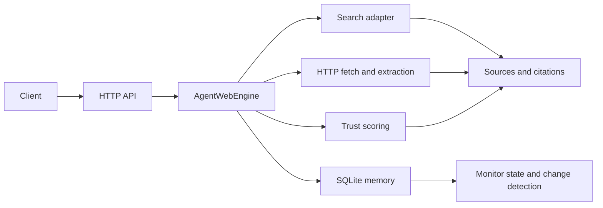

# AgentWeb

**AgentWeb is a free, dependency-light Internet intelligence platform for grounded research and page monitoring.** The repository contains a runnable Phase 0 MVP that exposes a small HTTP API for searching, extracting, synthesizing source-backed results, and detecting changes in monitored pages.

> The current implementation is intentionally small and local-first: Python's standard library, SQLite, and a public HTML search adapter are enough to run it. The broader platform vision remains documented as a phased roadmap.

## Contents

- [What is implemented](#what-is-implemented)
- [Quick start](#quick-start)
- [Configuration](#configuration)
- [HTTP API](#http-api)
- [Python API](#python-api)
- [Architecture](#architecture)
- [Data and persistence](#data-and-persistence)
- [Testing](#testing)
- [Project structure](#project-structure)
- [Current limitations](#current-limitations)
- [Roadmap](#roadmap)
- [Contributing](#contributing)
- [Security](#security)
- [Support](#support)
- [License](#license)

## What is implemented

The MVP follows the repository's Phase 0 requirements: a one-shot grounded-research endpoint, source ranking with a transparent trust score, citation-backed output, page extraction, and lightweight monitoring backed by snapshot hashes.

| Capability | Implementation in this repository |
| --- | --- |
| Grounded research | `POST /solve` accepts a task and returns an answer, sources, citations, execution ID, and timestamp. |
| Retrieval modes | `flash`, `focus`, `dive`, and `monitor` are accepted; they control the number of returned sources. |
| Search | `POST /search` uses the public DuckDuckGo HTML results page and returns an empty result list when the provider is unavailable. |
| Extraction | `POST /extract` fetches an HTTP(S) page and returns title, description, normalized text, status, and trust score. |
| Monitoring | `POST /observe` creates a SQLite-backed monitor; `GET /observe/{id}` checks its URL and records content changes; `DELETE /observe/{id}` removes it. |
| Memory reuse | SQLite stores content hashes and monitor state so unchanged snapshots do not produce false change events. |
| Authentication | Optional bearer-token authentication is enabled when `AGENTWEB_API_KEY` is set. |

The repository also includes the OpenAPI contract in [`openapi/openapi.yaml`](openapi/openapi.yaml), JSON schemas in [`schemas/`](schemas/), and design documentation under [`docs/`](docs/).

## Quick start

AgentWeb requires **Python 3.11 or newer** and has no runtime dependencies outside the Python standard library. The following commands install the local package in an isolated virtual environment and start the API server.

```bash
python3 -m venv .venv
source .venv/bin/activate
python -m pip install --upgrade pip
python -m pip install -e .
agentweb --host 127.0.0.1 --port 8000
```

In another terminal, call the health endpoint:

```bash
curl http://127.0.0.1:8000/health
```

Expected response:

```json
{"status": "ok", "service": "agentweb"}
```

Run a direct-URL research task:

```bash
curl -X POST http://127.0.0.1:8000/solve \
  -H 'Content-Type: application/json' \
  -d '{"task":"Summarize https://example.com","mode":"focus"}'
```

Create and check a monitor:

```bash
monitor=$(curl -s -X POST http://127.0.0.1:8000/observe \
  -H 'Content-Type: application/json' \
  -d '{"task":"Watch https://example.com","frequency":"daily"}')
monitor_id=$(printf '%s' "$monitor" | python3 -c 'import json,sys; print(json.load(sys.stdin)["id"])')
curl "http://127.0.0.1:8000/observe/$monitor_id"
```

## Configuration

Configuration is provided through environment variables and CLI flags. No secrets are committed to the repository.

| Setting | Default | Description |
| --- | --- | --- |
| `AGENTWEB_API_KEY` | unset | When set, every API request must include `Authorization: Bearer <value>`. |
| `AGENTWEB_QUIET` | unset | Set to `1` to suppress request logs. |
| `--host` | `127.0.0.1` | Server bind address. |
| `--port` | `8000` | Server port. |
| `--data` | `agentweb.sqlite3` | SQLite database path for monitor and snapshot state. |

For a network-facing deployment, bind the server behind a reverse proxy, use HTTPS, set an API key, and apply the operational controls appropriate to the environment. The included server is a compact local MVP rather than a complete production edge proxy.

## HTTP API

The API returns JSON. The endpoint shapes correspond to the repository's OpenAPI document.

| Method | Path | Purpose |
| --- | --- | --- |
| `GET` | `/health` | Liveness response. |
| `POST` | `/solve` | Run a grounded research task. Required field: `task`; optional fields: `mode`, `skill`, `inputs`, `webhook_url`, `idempotency_key`. |
| `POST` | `/observe` | Create a monitor. Required field: `task`; optional fields: `frequency` and `webhook_url`. |
| `GET` | `/observe/{id}` | Check a monitor and return its latest state. |
| `DELETE` | `/observe/{id}` | Cancel and delete a monitor. |
| `POST` | `/search` | Search with required `query` and optional `limit`. |
| `POST` | `/extract` | Extract a URL with required `url` and optional `schema`. |

A successful `/solve` response contains `execution_id`, `mode`, `answer`, `sources`, `citations`, and `created_at`. Each source includes an ID, URL, title, snippet, trust score, and citation flag. Errors use the documented `{ "error": { "type": ..., "message": ... } }` shape.

## Python API

The package can also be embedded without starting an HTTP server:

```python
from agentweb import AgentWebEngine

engine = AgentWebEngine()
result = engine.solve("Summarize https://example.com", mode="focus")
print(result.answer)
for source in result.sources:
    print(source.url, source.trust_score)
```

`AgentWebEngine` also exposes `extract`, `create_monitor`, and `check_monitor`. Use `MemoryStore` with a custom SQLite path when an application needs explicit data-location control.

## Architecture

The implemented path is intentionally direct while preserving the interfaces described by the project documents:



The longer-term architecture adds planning, routing, browser execution, graph reasoning, and synthesis layers. Those are described in [`docs/architecture.md`](docs/architecture.md) but are not claimed as implemented by this MVP.

## Data and persistence

The default `agentweb.sqlite3` file is created in the working directory on first server start. It contains monitor records and content snapshots. The server stores snapshot hashes and normalized text, not a separate external database or queue. The database file is ignored by Git through the repository's `.gitignore`.

Monitoring is request-driven in this implementation: `GET /observe/{id}` checks the target when called. A scheduler, webhook delivery, and recurring background worker are future roadmap items and are not silently implied by the current API.

## Testing

The test suite uses Python's built-in `unittest` framework and a local fixture HTTP server, so tests do not require internet access or paid services.

```bash
python3 -m compileall -q src tests
PYTHONPATH=src python3 -m unittest discover -s tests -v
```

The continuous integration workflow runs the same checks on Python 3.11.

## Project structure

| Path | Purpose |
| --- | --- |
| `src/agentweb/` | Runtime package: API, orchestration, fetching, search, memory, models, and CLI. |
| `tests/` | Deterministic unit and integration tests. |
| `openapi/openapi.yaml` | HTTP API contract. |
| `schemas/` | Request and response JSON schemas. |
| `docs/` | Product, architecture, API, and usage documentation. |
| `spec/` | Future module specifications, quality gates, and operational design. |
| `.github/` | CI, issue forms, pull-request template, and dependency-automation configuration. |

## Current limitations

This repository does not yet implement headless browser execution, a full crawler, a hosted search provider integration, LLM-based synthesis, graph storage, webhook delivery, scheduled background execution, rate limiting, or a multi-process deployment model. The public DuckDuckGo HTML adapter is best-effort and may be unavailable or change format. Direct page fetching should be used only with URLs and data sources that the operator is authorized to access.

These limitations are explicit so the repository's runnable behavior remains distinct from the broader product vision and roadmap.

## Roadmap

The source roadmap is [`docs/roadmap.md`](docs/roadmap.md). Phase 0 is the current implementation baseline. Future phases cover deeper retrieval modes, crawl and extraction expansion, webhooks, full snapshot history, graph reasoning, agent-native execution APIs, and event-driven workflows.

## Contributing

Read [`CONTRIBUTING.md`](CONTRIBUTING.md) before opening a pull request. Contributions should include focused tests and documentation updates when behavior or public contracts change.

## Security

Read [`SECURITY.md`](SECURITY.md) for the private vulnerability-reporting process and the current scope of security-sensitive areas. Do not commit API keys, cookies, database files, or downloaded private content.

## Support

For usage questions and repository issues, see [`SUPPORT.md`](SUPPORT.md). Please include the command, operating-system and Python versions, request shape, and a reproducible example that does not contain secrets.

## License

AgentWeb is released under the [MIT License](LICENSE).
