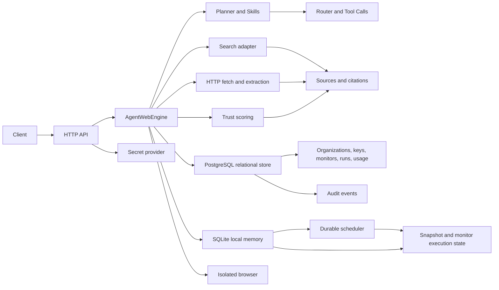

# AgentWeb

**AgentWeb is a free, dependency-light Internet intelligence platform for grounded research and page monitoring.** The repository contains a runnable Phase 0 MVP that exposes a small HTTP API for searching, extracting, synthesizing source-backed results, and detecting changes in monitored pages.

> The current implementation is intentionally small and local-first: Python's standard library, SQLite, and either the free DuckDuckGo HTML adapter or a configured HTTP JSON search provider are enough to run it. The broader platform vision remains documented as a phased roadmap.

## Contents

- [What is implemented](#what-is-implemented)
- [Quick start](#quick-start)
- [Configuration](#configuration)
- [HTTP API](#http-api)
- [Python API](#python-api)
- [Architecture](#architecture)
- [Data and persistence](#data-and-persistence)
- [Testing](#testing)
- [Project structure](#project-structure)
- [Current limitations](#current-limitations)
- [Roadmap](#roadmap)
- [Contributing](#contributing)
- [Security](#security)
- [Support](#support)
- [License](#license)

## What is implemented

The MVP follows the repository's Phase 0 requirements: a one-shot grounded-research endpoint, source ranking with a transparent trust score, citation-backed output, page extraction, and lightweight monitoring backed by snapshot hashes.

| Capability | Implementation in this repository |
| --- | --- |
| Grounded research | `POST /solve` accepts a task and returns an answer, sources, citations, execution ID, timestamp, evidence score, explicit conflicts, and selected output format. Weak evidence is marked `insufficient_evidence` instead of being fabricated. An optional `graph_query` supplies bounded graph context as additional grounded sources. |
| Retrieval modes | `flash`, `focus`, `dive`, and `monitor` are accepted; they control the number of returned sources. |
| Search | `POST /search` uses a pluggable provider boundary with free DuckDuckGo fallback, optional HTTP JSON provider configuration, freshness filters, normalized published dates when supplied, and graceful provider failure. |
| Extraction | `POST /extract` parses an HTTP(S) page and returns title, description, normalized text, links, warnings, overall confidence, field-level confidence, and optional schema-guided fields with confidence scores. Parser-derived pages and mentions are also ingested into the tenant graph with source provenance. |
| Parsing and normalization | Standalone parser and normalizer modules handle HTML, JSON, text, PDF fallback warnings, prices, dates, entities, and raw-value preservation. |
| Trust and ranking | Unsafe target classes are blocked by default; accepted sources are ranked using trust, task relevance, and corroboration signals. |
| Monitoring | `GET /observe` lists organization monitors with cursor pagination; `POST /observe` creates an organization-scoped SQLite monitor; `GET /observe/{id}` checks its URL, records explicit `no_change`/`change_detected`/`check_failed` events, and exposes queued webhook delivery status, attempts, retries, and dead-letter failures. |
| Crawling | `POST /crawl` performs bounded same-origin breadth-first traversal with robots and trust checks, persists tenant-scoped run/page metadata and immutable page snapshots, and returns a durable `crawl_id`; `GET /crawl` and `GET /crawl/{id}` expose history without cross-tenant disclosure. |
| Memory reuse | SQLite stores immutable content versions, hashes, monitor state, crawl history, and explicit diffs, all scoped by organization; bounded retention cleanup purges expired snapshots and crawl runs, either immediately or through a queued `retention_gc` job. |
| Authentication and limits | Bearer keys support endpoint scopes; persistent keys are PBKDF2-hashed, organization-scoped, revocable, briefly cached, and protected by per-identity rate limits. |
| Observability | Each solve, browser, and monitor operation records secret-safe organization-scoped spans retrievable through `/report/{execution_id}`; the API also emits bounded structured JSON request logs with UTC timestamps, correlation IDs, status, and redacted targets unless `AGENTWEB_QUIET=1` is set. |
| Browser execution | `POST /browser/sessions` renders JavaScript pages through fresh contexts and a bounded lazily spawned browser-worker pool; worker failures remain typed and retryable. Authorized operators can provision encrypted, origin-bound storage state and reuse it through opaque `session_state_id` references without exposing tokens. |
| Connector routing | Applications can register URL/domain connectors through `ConnectorRegistry`; the router selects the longest matching pattern and applies bounded extraction hints, default browser actions, and ranking bias without changing generic fallback behavior. |
| Plugin extensibility | Reviewed process-local `Plugin` registrations are organization-scoped and versioned. Connector, skill, and ranker hooks are bounded and fail-safe; exceptions, invalid outputs, and timeouts fall back to core behavior. See [`docs/guides/plugins.md`](docs/guides/plugins.md). |
| Vector retrieval | `VectorStore` provides deterministic hashed-token embeddings, persistent nearest-neighbor search, separate `skills` and `entities:<org_id>` namespaces, semantic skill fallback matching, and cautious graph entity resolution. |
| Learning loop | Every solve records redacted strategy, mode, success, evidence, execution ID, and latency signals; `GET /learning/summary` exposes tenant-scoped aggregates and `POST /learning/outcomes` accepts bounded evaluator feedback without raw task content. |
| Administration | Authenticated `admin:*` keys can create/list/revoke organization keys and browser credentials/session states, read cursor-paginated immutable audit events, read monthly usage summaries, and request idempotent tenant cleanup across snapshots, traces, graph/vector data, learning outcomes, workflows, and queued workflow payloads; plaintext secrets are returned only once at creation. |
| Knowledge graph | Tenant-scoped entity and relation upserts are available through `POST /graph/entities` and `POST /graph/relations`; extraction and monitor checks automatically add page/mention provenance; `GET /graph/query` supports entity, relation, related-node, bounded depth filters, and opaque cursor pagination. Source provenance, observation counts, corroboration bonuses, stale-edge decay, and organization isolation are preserved. |
| Event-driven workflows | `POST /workflows` registers an organization-scoped task template for monitor `change_detected`, `no_change`, or `check_failed` events; matching events create durable `workflow_run` jobs, the supervised worker renders the template and executes a grounded solve, and redacted run records are available through `GET /workflows/runs`. Queue leases, retries, rate limits, and dead-letter behavior reuse the scheduler. `POST /workflows/pause` and `/workflows/resume` provide idempotent operator controls. |

The repository also includes the OpenAPI contract in [`openapi/openapi.yaml`](openapi/openapi.yaml), JSON schemas in [`schemas/`](schemas/), and design documentation under [`docs/`](docs/).

## Four-mode MCP interface

The bundled MCP server exposes `agentweb_capabilities`, `agentweb_research`, `agentweb_parallel_research`, `agentweb_extract_page`, `agentweb_crawl`, `agentweb_browser_open`, `agentweb_create_monitor`, `agentweb_check_monitor`, `agentweb_list_monitors`, `agentweb_create_plan`, and `agentweb_execute_plan`. Research supports `flash`, `focus`, `dive`, and `monitor`; each run uses a bounded adaptive evidence loop, and independent tasks can be submitted concurrently through `agentweb_parallel_research`.

Flash generates up to two semantic query variants and performs light retrieval. Focus generates four variants and performs concurrent source waves. Dive generates six variants and fans out across public technical, discussion, academic, archival, and long-form branches. Monitor supports durable scheduled checks and adaptive public-source discovery. After each wave, AgentWeb evaluates source diversity, authority, corroboration, conflicts, and missing source families; it schedules targeted follow-up queries only when the evidence gate is not satisfied, then returns a secret-safe trace with waves, concurrency, gaps, and the explicit stop reason. GitHub and Reddit are available in every mode, but factual source families are prioritized when the task warrants them. The response includes the full bounded normalized evidence bundle alongside the synthesized answer.

Direct public video URLs are supported through OpenGraph and YouTube player metadata. When a public YouTube page exposes caption tracks, AgentWeb attempts to fetch and include the caption transcript as grounded evidence; private, gated, or unavailable captions are reported as unavailable rather than bypassed. Self-hosted and credentialed integrations are intentionally not enabled in the default runtime. See [`selfhosting.md`](selfhosting.md) for the complete exclusion list and integration boundaries. The supplied inventory is preserved in [`AgentWeb-mode-tool-map.md`](AgentWeb-mode-tool-map.md). Render deployment defaults are provided in [`render.yaml`](render.yaml).

Run the MCP server over stdio with:

```bash
agentweb-mcp --transport stdio --data agentweb.sqlite3
```

For streamable HTTP, use `agentweb-mcp --transport streamable-http --host 127.0.0.1 --port 8000`; the MCP endpoint is `/mcp`. Optional adaptive controls on `agentweb_research` and `agentweb_parallel_research` include `max_rounds`, `max_concurrency`, `evidence_target`, and `include_all_evidence`. Model-assisted query suggestions remain disabled unless an operator explicitly configures the endpoint and credentials documented in [`selfhosting.md`](selfhosting.md).

## Quick start

AgentWeb requires **Python 3.11 or newer** and has no default runtime dependencies outside the Python standard library. The following commands install the local package in an isolated virtual environment and start the API server.

```bash
python3 -m venv .venv
source .venv/bin/activate
python -m pip install --upgrade pip
python -m pip install -e .
agentweb --host 127.0.0.1 --port 8000
```

In another terminal, call the health endpoint:

```bash
curl http://127.0.0.1:8000/health
```

Expected response:

```json
{"status": "ok", "service": "agentweb"}
```

Run a direct-URL research task:

```bash
curl -X POST http://127.0.0.1:8000/solve \
  -H 'Content-Type: application/json' \
  -d '{"task":"Summarize https://example.com","mode":"focus"}'
```

For rendered browser sessions, install the optional free browser extra and point AgentWeb at an installed Chromium-compatible binary:

```bash
python -m pip install -e '.[browser]'
export AGENTWEB_CHROMIUM_PATH=/usr/bin/chromium
```

Run the durable monitor scheduler in a separate supervised process:

```bash
agentweb --worker --data agentweb.sqlite3
```

Use `--once` for a health check or a cron/supervisor probe that executes one due job and exits:

```bash
agentweb --worker --once --data agentweb.sqlite3
```

Create and check a monitor:

```bash
monitor=$(curl -s -X POST http://127.0.0.1:8000/observe \
  -H 'Content-Type: application/json' \
  -d '{"task":"Watch https://example.com","frequency":"daily"}')
monitor_id=$(printf '%s' "$monitor" | python3 -c 'import json,sys; print(json.load(sys.stdin)["id"])')
curl "http://127.0.0.1:8000/observe/$monitor_id"
```

## Configuration

Configuration is provided through environment variables and CLI flags. No secrets are committed to the repository.

| Setting | Default | Description |
| --- | --- | --- |
| `AGENTWEB_API_KEY` | unset | Single local bearer key; when set, every API request must include `Authorization: Bearer <value>`. |
| `AGENTWEB_API_KEY_ORG` | `env` | Organization ID assigned to the single environment key. |
| `AGENTWEB_API_KEYS` | unset | JSON object mapping bearer keys to scope arrays, or objects with `scopes` and `org_id`, for local scope testing. |
| `AGENTWEB_BLOCKED_DOMAINS` | unset | Comma-separated domain suffixes rejected by the trust engine. |
| `AGENTWEB_WEBHOOK_SIGNING_KEY` | unset | HMAC secret required before change alerts can be delivered. |
| `AGENTWEB_ALLOW_PRIVATE_TARGETS` | unset | Test-only override for local fixture servers; do not enable in a network-facing deployment. |
| `AGENTWEB_QUIET` | unset | Set to `1` to suppress request logs. |
| `LOG_LEVEL` | `info` | Minimum structured request-log severity: `debug`, `info`, `warn`, or `error`. |
| `AGENTWEB_ALLOWED_ORIGINS` | unset | Comma-separated browser origins allowed for CORS; wildcard CORS is retained only for unauthenticated local development. |
| `AGENTWEB_BROWSER_PROCESS_WORKERS` | `1` | Bounded spawned browser-worker process count; set to `0` for direct in-process execution, capped at 8. |
| `AGENTWEB_ENV` | `development` | Runtime environment: `development`, `staging`, or `production`; non-development environments fail closed on local-only secrets. |
| `AGENTWEB_SECRET_PROVIDER` | `env` in development | Secret source: `env`, injected `mapping` for tests, or a command-backed provider. Staging/production must not use `env`. |
| `AGENTWEB_SECRET_COMMAND` | unset | Executable used by the command provider; it receives only the secret name and returns the value on stdout. |
| `AGENTWEB_SECRET_TTL_SECONDS` | `30` | Maximum in-process secret cache lifetime, bounded to 300 seconds. |
| `AGENTWEB_DB_POOL_SIZE` | `4` | Bounded PostgreSQL connection pool size, capped at 32. |
| `DATABASE_URL` | SQLite in development | `sqlite:///...` for local use; staging/production require `postgresql://...` and the `postgres` extra. |
| `--host` | `127.0.0.1` | Server bind address. |
| `--port` | `8000` | Server port. |
| `--data` | `agentweb.sqlite3` | SQLite database path for monitor, snapshot, crawl, and retention-job state. |

For a network-facing deployment, set `AGENTWEB_ENV=staging` or `production`, source platform secrets through `AGENTWEB_SECRET_PROVIDER=command` or an injected deployment provider, set a PostgreSQL `DATABASE_URL`, install `agentweb[production]`, and put the API behind a TLS-terminating reverse proxy. The included server remains a compact application boundary rather than a complete production edge proxy.

The production relational migration is additive and non-destructive. Export a local database without modifying it:

```bash
agentweb migrate-export --source agentweb.sqlite3 --output ./migration-export
agentweb migrate-export --source agentweb.sqlite3 --output ./migration-export --dry-run
```

For an authenticated production deployment, validate or apply the export using a PostgreSQL `DATABASE_URL` resolved by the configured secret provider:

```bash
agentweb migrate-import --input ./migration-export --dry-run
agentweb migrate-import --input ./migration-export
```

The importer bootstraps the relational schema, validates the manifest checksums, applies rows in one transaction, and records `relational-v1` so retries are idempotent. There is intentionally no destructive down-migration; rollback is performed by stopping the new API tier and returning to the prior SQLite-compatible deployment until the import is corrected.

## HTTP API

The API returns JSON. The canonical public URL form is `/v1/...`, matching the OpenAPI server definition. Bare paths remain available for local compatibility and return `Deprecation: true`; unsupported future major prefixes are rejected rather than routed to v1 handlers. The endpoint shapes correspond to the repository's OpenAPI document.

| Method | Path | Purpose |
| --- | --- | --- |
| `GET` | `/health` | Liveness response. |
| `POST` | `/plan` | Create a tenant-scoped, inspectable plan without executing it. Required field: `task`; optional fields: `mode`, `skill`, and `inputs`. Plans expire from the bounded in-memory store after 15 minutes. Requires `solve:execute`. |
| `POST` | `/execute` | Execute a previously approved `plan_id` for the same organization; supports `Idempotency-Key` and optional `output_format`. Requires `solve:execute`. |
| `POST` | `/solve` | Run a grounded research task. Required field: `task`; optional fields: `mode`, `skill`, `inputs`, `graph_query`, `webhook_url`, `idempotency_key`, and `output_format` (`text`, `comparison`, `timeline`, or `json`). `graph_query` supports bounded graph-assisted synthesis. |
| `GET` | `/observe` | List organization monitors using optional `cursor` and bounded `limit` query parameters. |
| `POST` | `/observe` | Create a monitor. Required field: `task`; optional fields: `frequency` and `webhook_url`; supports `Idempotency-Key`. |
| `POST` | `/crawl` | Run a bounded same-origin crawl. Required field: `start_url`; optional fields: `max_pages`, `depth`, `url_pattern`, and `idempotency_key`. |
| `GET` | `/crawl` | List tenant-scoped crawl runs using optional `cursor` and bounded `limit` query parameters. |
| `GET` | `/crawl/{crawl_id}` | Retrieve one crawl run and its bounded page metadata. |
| `GET` | `/observe/{id}` | Check a monitor and return its latest state. |
| `DELETE` | `/observe/{id}` | Cancel and delete a monitor; supports `Idempotency-Key`. |
| `POST` | `/search` | Search with required `query` and optional `limit` (maximum 50) and `freshness` (`day`, `week`, `month`, `year`, or `any`). Provider selection is configured through `AGENTWEB_SEARCH_PROVIDER`. |
| `POST` | `/extract` | Extract a URL with required `url` and optional `schema`; returns overall and field-level confidence metadata. |
| `POST` | `/browser/sessions` | Render a URL with optional actions, encrypted credential reference, and origin-bound `session_state_id`. Requires `browser:execute`. |
| `GET` | `/admin/browser-session-states` | List non-secret encrypted browser session-state metadata; requires `admin:*`. |
| `POST` | `/admin/browser-session-states` | Create encrypted origin-bound Playwright storage state; requires `admin:*` and supports `Idempotency-Key`. |
| `DELETE` | `/admin/browser-session-states/{id}` | Revoke encrypted browser session state; requires `admin:*`. |
| `GET` | `/memory/{target}` | List immutable snapshots for a target. |
| `GET` | `/memory/{target}/diff` | Compare two stored snapshots using `from` and `to` hashes. |
| `GET` | `/graph/query` | Query tenant-scoped graph nodes and edges using optional `entity_type`, `related_to`, `relation`, `depth`, `limit`, and opaque `cursor` filters; requires `graph:read`. |
| `POST` | `/graph/entities` | Create or merge a graph entity; requires `graph:write` and supports `Idempotency-Key`. |
| `POST` | `/graph/relations` | Create or corroborate a graph relation; requires `graph:write` and supports `Idempotency-Key`. |
| `GET` | `/workflows` | List organization-scoped event-driven workflow definitions; requires `workflow:manage`. |
| `POST` | `/workflows/pause` | Pause a workflow by `workflow_id` without deleting definitions or historical runs; requires `workflow:manage`. |
| `POST` | `/workflows/resume` | Resume a paused workflow by `workflow_id`; requires `workflow:manage`. |
| `POST` | `/workflows` | Register a monitor event workflow with a bounded task template; requires `workflow:manage` and supports `Idempotency-Key`. |
| `GET` | `/workflows/runs` | List organization-scoped workflow execution records; requires `workflow:manage`. |
| `GET` | `/learning/summary` | List tenant-scoped strategy and mode outcome aggregates; requires `learning:read`. |
| `POST` | `/learning/outcomes` | Record bounded evaluator feedback without raw task content; requires `learning:write` and supports `Idempotency-Key`. |
| `GET` | `/report/{execution_id}` | Retrieve a secret-safe execution trace belonging to the caller's organization. |
| `GET` | `/report/{execution_id}/replay` | Retrieve an ordered, read-only historical replay projection with sanitized summaries; no network calls or side effects are performed. |
| `GET` | `/admin/keys` | List redacted, cursor-paginated API keys for the caller's organization; requires `admin:*`. |
| `POST` | `/admin/keys` | Create a scoped organization key; requires `admin:*`; returns the secret only once and supports `Idempotency-Key`. |
| `DELETE` | `/admin/keys/{id}` | Revoke an organization key; requires `admin:*`; supports `Idempotency-Key`. |
| `GET` | `/admin/audit` | Read cursor-paginated immutable security events for the caller's organization; requires `admin:*`. |
| `GET` | `/admin/usage` | Read organization-scoped monthly usage and estimated cost; requires `admin:*`. |
| `DELETE` | `/admin/data` | Delete selected organization-owned snapshots, crawl history, browser session states, graph/vector data, learning outcomes, workflows, queued workflow payloads, or execution traces; requires `admin:*` and supports `Idempotency-Key`. |

Successful JSON object responses retain their endpoint-specific fields and include an additive `_meta` object containing `request_id`, `api_version: "v1"`, the canonical `/v1/...` path, and a `deprecated` flag. The request ID is also returned through `X-Request-ID`, and responses include `X-AgentWeb-API-Version: v1`. Bare compatibility paths set `deprecated` to `true` and return `Deprecation: true`; `204` responses remain bodyless. A successful `/plan` response contains an opaque `plan_id`, sanitized plan metadata, creation and expiry timestamps, and `reusable: true`; it does not return the task text or inputs. `/execute` reuses that exact approved plan and returns the normal grounded solve response plus `plan_id`. A successful `/solve` response contains `execution_id`, `mode`, `answer`, `sources`, `citations`, and `created_at`, plus sanitized `plan`, `selection_logic`, and `actions` fields that explain intent, source strategy, routed stages, counts, selected source IDs, and evidence metrics without exposing task parameters, credentials, cookies, or raw page content. Each source includes an ID, URL, title, snippet, trust score, and citation flag. Errors retain the documented `{ "error": { "type": ..., "message": ... } }` shape and do not include success metadata.

## Python API

The package can also be embedded without starting an HTTP server:

```python
from agentweb import AgentWebEngine

engine = AgentWebEngine()
result = engine.solve("Summarize https://example.com", mode="focus")
print(result.answer)
for source in result.sources:
    print(source.url, source.trust_score)
```

`AgentWebEngine` also exposes `extract`, `create_monitor`, and `check_monitor`. The package additionally exports deterministic `Planner`, `Router`, `Plan`, `PlanStep`, `ToolCall`, `SkillRegistry`, `Connector`, `ConnectorRegistry`, `Plugin`, and `PluginRegistry` contracts for local orchestration. Register connectors during startup through `engine.connectors` and reviewed organization-scoped plugins through `engine.plugins`; see [`docs/guides/plugins.md`](docs/guides/plugins.md). Use `MemoryStore` with a custom SQLite path when an application needs explicit data-location control.

## Architecture

The implemented path is intentionally local-first while preserving the interfaces described by the project documents. `AgentWebEngine.solve` now creates an explicit plan, routes it to bounded local tool calls, and then runs the existing memory, search, extraction, ranking, and synthesis stages:



The current local-first architecture includes public plan/execute APIs, connector-specific routing, bounded graph reasoning, privacy-safe learning persistence, event-driven workflow runs, plugin hooks, and richer synthesis. Rendered browser execution, durable scheduled monitor jobs, durable crawl history, optional coordinator-backed crawl throttling, a bounded spawned browser-worker pool, and encrypted origin-bound browser session state are also implemented foundations. Full relational runtime cutover, calibrated evaluation, and hosted/operator integrations remain future work.

## Data and persistence

The default `agentweb.sqlite3` file is created in the working directory on first server start. It contains organizations, hashed API keys, immutable content snapshots, organization-scoped monitor records, durable crawl runs and page metadata, encrypted browser credentials and origin-bound session states, execution traces, audit events, and durable scheduler jobs with leases, retry state, and bounded `retention_gc` payloads. Sensitive browser state is never returned by listing or browser responses. The database file is ignored by Git through the repository's `.gitignore`.

Monitoring can be checked synchronously through `GET /observe/{id}` or asynchronously by running `agentweb --worker`. The worker claims due jobs, prioritizes minutely monitors, executes scheduled retention cleanup, reschedules successful checks by frequency, retries worker failures, and records exhausted jobs as `dead_letter`. Use `agentweb gc --schedule` to enqueue cleanup without running it in the API process.

## Testing

The test suite uses Python's built-in `unittest` framework and a local fixture HTTP server, so tests do not require internet access or paid services.

```bash
python3 -m compileall -q src tests
PYTHONPATH=src python3 -m unittest discover -s tests -v
```

The continuous integration workflow runs the same checks on Python 3.11. GitHub Actions may still be unavailable when account-level Actions policy disables execution; local validation remains deterministic.

## Project structure

| Path | Purpose |
| --- | --- |
| `src/agentweb/` | Runtime package: API, orchestration, fetching, search, memory, models, and CLI. |
| `tests/` | Deterministic unit and integration tests. |
| `openapi/openapi.yaml` | HTTP API contract. |
| `schemas/` | Request and response JSON schemas. |
| `docs/` | Product, architecture, API, and usage documentation. |
| `spec/` | Future module specifications, quality gates, and operational design. |
| `.github/` | CI, issue forms, pull-request template, and dependency-automation configuration. |

## Current limitations

This repository does not yet implement CAPTCHA/MFA automation, LLM-based synthesis, or a full relational runtime cutover.
  External secret resolution, organization-scoped idempotency records, usage summaries, cursor pagination, an optional PostgreSQL relational adapter, additive migration manifests, schema bootstrap, checksum validation, transaction-scoped import, and coordinator-aware retention scheduling are implemented; a managed cloud secret backend, full runtime dual-write cutover, and snapshot/graph migration remain deployment work. The local HTTP API and monitor execution continue to use the SQLite memory boundary until a production deployment wires all relational ownership paths to the PostgreSQL adapter.
 Rendered browser sessions and scheduled monitor execution are available through the optional browser extra and the supervised `agentweb --worker` process. The public DuckDuckGo HTML adapter is best-effort and may be unavailable or change format.
 Direct page fetching should be used only with URLs and data sources that the operator is authorized to access.

These limitations are explicit so the repository's runnable behavior remains distinct from the broader product vision and roadmap.

## Roadmap

The source roadmap is [`docs/roadmap.md`](docs/roadmap.md). The current implementation covers the dependency-free core of the Phase 0 baseline, several Phase 1 foundations, a Phase 2 graph storage/query slice, durable event-driven workflow jobs, connector-aware routing, deterministic vector retrieval, a privacy-safe learning loop, and a reviewed process-local plugin registry, including bounded durable crawling, scheduled monitoring, process-isolated browser execution, encrypted reusable browser session state, tenant-scoped graph entities/relations, corroboration-aware graph confidence, monitor-triggered task templates, queued workflow runs with scheduler retries, semantic skill fallback, cautious entity resolution, automatic solve outcome recording, aggregate strategy summaries, and organization-scoped connector/skill/ranker hooks. Future work covers richer external event integrations, managed connector persistence, and calibrated production evaluation.

## Contributing

Read [`CONTRIBUTING.md`](CONTRIBUTING.md) before opening a pull request. Contributions should include focused tests and documentation updates when behavior or public contracts change.

## Security

Read [`SECURITY.md`](SECURITY.md) for the private vulnerability-reporting process and the current scope of security-sensitive areas. Do not commit API keys, cookies, database files, or downloaded private content.

## Support

For usage questions and repository issues, see [`SUPPORT.md`](SUPPORT.md). Please include the command, operating-system and Python versions, request shape, and a reproducible example that does not contain secrets.

## License

AgentWeb is released under the [MIT License](LICENSE).
